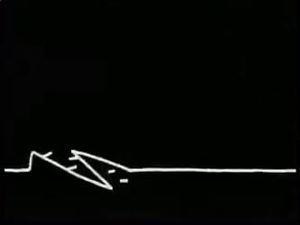

# GitHub README Connect4  

Here you can play Connect4. It's your turn to play! Just click under the grid, where to put the next a <!-- BEGIN TURN -->yellow<!-- END TURN --> piece.

<!-- BEGIN CONNECT4 BOARD -->
|   | 1 | 2 | 3 | 4 | 5 | 6 | 7 |   |
|---|:-:|:-:|:-:|:-:|:-:|:-:|:-:|:-:|
|---| |  |  |  |  |  |  | |---|
|---| |  |  |  |  |  |  | |---|
|---| |  |  |  |  |  |  | |---|
|---| |  |  |  |  |  |  | |---|
|---| |  |  |  |  |  |  | |---|
|---| |  |  |  |  |  |  | |---|
|   | [1](https://github.com/bloedboemmel/bloedboemmel/issues/new?body=Please+do+not+change+the+title.+Just+click+%22Submit+new+issue%22.+You+don%27t+need+to+do+anything+else+%3AD&title=Connect4%3A+Put+1) | [2](https://github.com/bloedboemmel/bloedboemmel/issues/new?body=Please+do+not+change+the+title.+Just+click+%22Submit+new+issue%22.+You+don%27t+need+to+do+anything+else+%3AD&title=Connect4%3A+Put+2) | [3](https://github.com/bloedboemmel/bloedboemmel/issues/new?body=Please+do+not+change+the+title.+Just+click+%22Submit+new+issue%22.+You+don%27t+need+to+do+anything+else+%3AD&title=Connect4%3A+Put+3) | [4](https://github.com/bloedboemmel/bloedboemmel/issues/new?body=Please+do+not+change+the+title.+Just+click+%22Submit+new+issue%22.+You+don%27t+need+to+do+anything+else+%3AD&title=Connect4%3A+Put+4) | [5](https://github.com/bloedboemmel/bloedboemmel/issues/new?body=Please+do+not+change+the+title.+Just+click+%22Submit+new+issue%22.+You+don%27t+need+to+do+anything+else+%3AD&title=Connect4%3A+Put+5) | [6](https://github.com/bloedboemmel/bloedboemmel/issues/new?body=Please+do+not+change+the+title.+Just+click+%22Submit+new+issue%22.+You+don%27t+need+to+do+anything+else+%3AD&title=Connect4%3A+Put+6) | [7](https://github.com/bloedboemmel/bloedboemmel/issues/new?body=Please+do+not+change+the+title.+Just+click+%22Submit+new+issue%22.+You+don%27t+need+to+do+anything+else+%3AD&title=Connect4%3A+Put+7) |   |
<!-- END CONNECT4 BOARD -->
<!-- BEGIN MOVES LIST -->
<!-- END MOVES LIST -->
Having fun? Ask a friend to do the next move!

## How it works

When you click on a link and submit a new issue with the desired move, a GitHub action is triggered, which in turn runs a small python script that performs the specified movement, updates this README file and commits the changes.

Maybe you already figured out, that this game is very much like [the README-Chessgame from marcizhu ](https://github.com/marcizhu/readme-chess). I indeed copied a lot from his code, but wrote my own Connect4-Script. I hope to get more independent of that, but till then I need to rely on his code snippets!

Have you spotted a bug? Something missing? Feel free to open an [issue](https://github.com/bloedboemmel/readme-connect4/issues) and I will try to fix it as soon as possible :D

  
Last 5 moves in this game

<!-- BEGIN LAST MOVES -->

| Move | Author |
| :--: | :----- |
| `4` |  [ @BolaGhaly](https://github.com/BolaGhaly) | |
| `4` |  [ @bloedboemmel](https://github.com/bloedboemmel) | |
| `Start game` |  [ @bloedboemmel](https://github.com/bloedboemmel) | |

<!-- END LAST MOVES -->

  
Top 10 most moves across all games

<!-- BEGIN TOP MOVES -->

| Total moves |  User  |
| :---------: | :----- |
| 28 |  [@bloedboemmel](https://github.com/bloedboemmel) | |
| 10 |  [@antjacquemin](https://github.com/antjacquemin) | |
| 5 |  [@JaouherK](https://github.com/JaouherK) | |
| 4 |  [@RainerWein](https://github.com/RainerWein) | |
| 3 |  [@Carol42](https://github.com/Carol42) | |
| 2 |  [@jeremie1112](https://github.com/jeremie1112) | |
| 2 |  [@vikash2806](https://github.com/vikash2806) | |
| 2 |  [@trinib](https://github.com/trinib) | |
| 2 |  [@willnaoosmith](https://github.com/willnaoosmith) | |
| 1 |  [@nadiaahmadian96](https://github.com/nadiaahmadian96) | |

<!-- END TOP MOVES -->

## It's messy

I know this code is still quite messy. I will work on it at [My Connect4-Repo](https://github.com/bloedboemmel/readme-connect4). There you can play too. If you have issues, create an issue there.

# Hey Bloedboemmel, what else do you do? 
[ LinkedIn](https://www.linkedin.com/in/jakob--jung/)
## Spotify-Status 🎧

  
  

## Stop stalking, start talking!
## Recent activity
<!--RECENT_ACTIVITY:start-->
1. ⭐ Starred [leandertolksdorf/1001-tracklists-api](https://github.com/leandertolksdorf/1001-tracklists-api)
2. 💬 Commented on [#9](https://github.com/leandertolksdorf/1001-tracklists-api/issues/9#issuecomment-1083505289) in [leandertolksdorf/1001-tracklists-api](https://github.com/leandertolksdorf/1001-tracklists-api)
3. 🎉 Merged PR [#17](https://github.com/bloedboemmel/Discord-Counting-Bot/pull/17) in [bloedboemmel/Discord-Counting-Bot](https://github.com/bloedboemmel/Discord-Counting-Bot)
4. 🎉 Merged PR [#16](https://github.com/bloedboemmel/Discord-Counting-Bot/pull/16) in [bloedboemmel/Discord-Counting-Bot](https://github.com/bloedboemmel/Discord-Counting-Bot)
5. ❌ Closed PR [#14](https://github.com/bloedboemmel/Discord-Counting-Bot/pull/14) in [bloedboemmel/Discord-Counting-Bot](https://github.com/bloedboemmel/Discord-Counting-Bot)
<!--RECENT_ACTIVITY:end-->

<!--RECENT_ACTIVITY:last_update-->
Last Updated: Sunday, August 14th, 2022, 9:07:51 PM
<!--RECENT_ACTIVITY:last_update_end-->

## Did you know that...
... <!--STARTS_HERE_QUOTE_README-->
<i>❝Konrad Zuse is the inventor of the first programmable computer in the world. He did it in 1936 and named the computer as Z1. Konrad Zuse❞</i>
<!--ENDS_HERE_QUOTE_README-->

## If you're still here, here's my favorite gif/music video:

